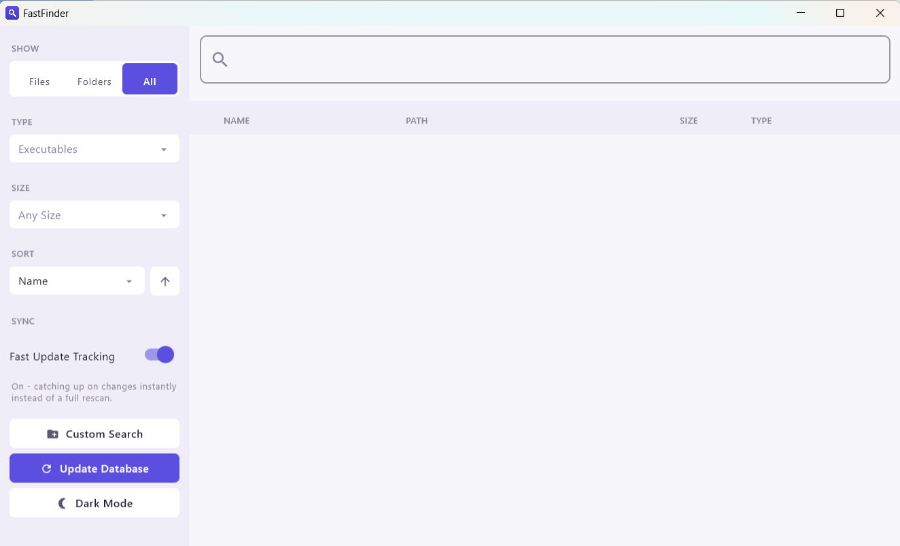
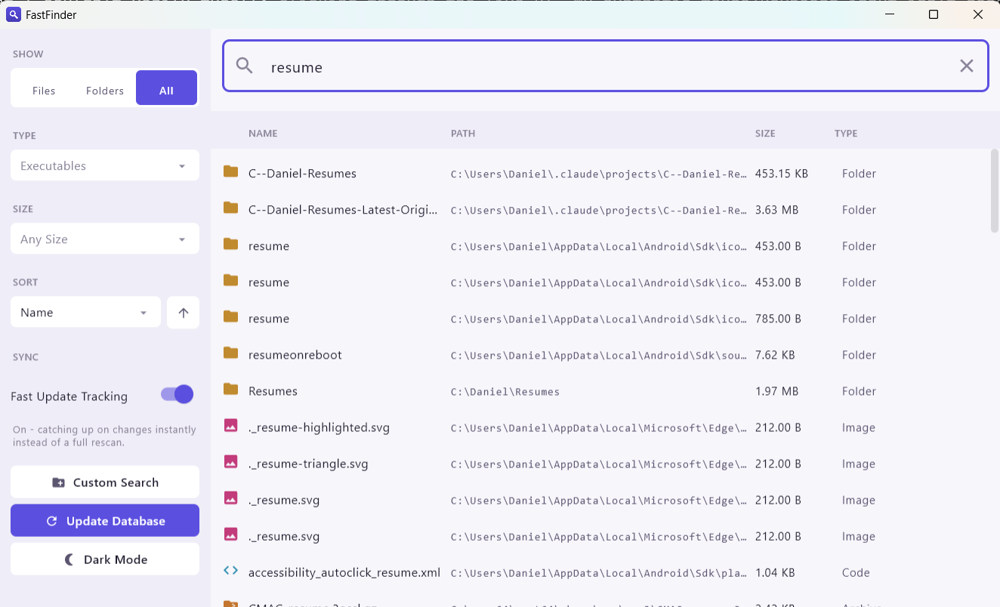

# FastFinder

[](https://github.com/Daniel-Pino-2000/FastFinder/actions/workflows/ci.yml)
[](LICENSE)

FastFinder is a Windows desktop app that indexes local storage in the background and gives
you instant, filterable full-text search over files and folders - built with Kotlin, Jetpack
Compose Desktop, and Apache Lucene.

---

## Contents

1. [Installing](#installing)
2. [Features](#features)
3. [Architecture](#architecture)
4. [Building and running](#building-and-running)
5. [Testing and static analysis](#testing-and-static-analysis)
6. [Performance](#performance)
7. [Screenshots](#screenshots)
8. [About the Developer](#about-the-developer)

---

## Installing

Download the latest `FastFinder-x.y.z.msi` from the
[Releases page](https://github.com/Daniel-Pino-2000/FastFinder/releases) and run it. Windows
is the only supported platform.

The installer isn't code-signed, so SmartScreen will likely show an "Unknown publisher"
warning the first time you run it - click **More info > Run anyway** to proceed. This is
expected for a project without a paid code-signing certificate, not a sign anything's wrong.

## Features

- **Background indexing.** On first launch, FastFinder walks local storage and builds a
  Lucene index in the background; you can search the moment the first index finishes,
  without waiting for future re-indexes.
- **Search-as-you-type**, debounced against the index so a burst of keystrokes only ever
  triggers the search for the last one.
- **Filtering and sorting**: by files/folders/both, by file type (image, video, audio,
  document, executable), by size range, and sortable by name/size/type in either direction
  (folders always sort first, matching Explorer convention).
- **Custom directory search** - search a specific folder directly via a live filesystem walk,
  usable even while the background index is being (re)built.
- **Live re-indexing** with progress reporting, without blocking search against the previous
  index while it runs.
- **Fast Update Tracking** (opt-in, via a settings toggle) - reads the NTFS USN Journal to catch
  up on filesystem changes made while the app was closed instantly, instead of a full rescan.
  Opening a volume handle for that is restricted to administrators, so enabling it relaunches
  the app elevated; it stays off by default so a first launch never triggers an unexplained UAC
  prompt.
- Light/dark theme.

## Architecture

```
index/   DBManager     - builds and maintains the Lucene index; owns index lifecycle & crash-safety
search/  Search        - queries the index, or walks a directory directly for custom search
model/                 - SystemItem, SearchMode/SearchFilter/SortBy/SizeFilter
ui/                    - Compose Desktop screens (FastFinderApp, ResultsList, SearchControls, ...)
util/                  - file-type classification, sorting/visibility rules, logging, paths
```

A few design decisions worth calling out:

- **Indexing is a parallel, work-stealing fork-join walk**, not one thread per drive: each
  directory is its own `RecursiveTask` that forks one child task per subdirectory, so every
  worker thread stays busy even on a machine with a single drive. Each task returns its
  subtree's total size so parent directories can sum children directly, rather than every
  file walking back up through all of its ancestors. See [Performance](#performance) for
  measured numbers.
- **Index replacement is crash-safe.** A rebuild writes to a fresh temporary directory and
  only touches the live index once the new one has committed successfully. Swapping it in
  moves the previous index aside (a single directory rename) rather than deleting it in
  place file-by-file - so a single locked or undeletable file can't leave the index
  half-deleted. If anything fails after that, the previous index is moved back and search
  keeps working against it.
- **Search requests cancel each other.** Search-as-you-type and an explicit search/custom
  directory search both go through one cancellable job, so a slow directory walk can't
  finish late and silently overwrite fresher results with stale ones.

## Building and running

Requires JDK 21.

```
./gradlew run              # run the app
./gradlew packageMsi       # build a native Windows installer (see build/compose/binaries)
```

## Testing and static analysis

```
./gradlew test             # unit tests (JUnit 5)
./gradlew detekt           # static analysis; config/detekt/baseline.xml grandfathers
                            # pre-existing findings so only new issues fail the build
./gradlew benchmarkIndexing  # one-off indexing performance benchmark, see below
```

CI runs `test` and `detekt` on every push/PR via GitHub Actions, on `windows-latest` -
FastFinder is a Windows-only app (Explorer integration, Windows-specific restricted-directory
handling), so CI targets the same platform it actually ships for.

## Performance

`./gradlew benchmarkIndexing` builds a synthetic tree and times the fork-join parallel walk
against a single-threaded run over the identical tree and code path, so the only variable is
the thread count.

Measured on a 28-logical-core machine, 30,000 files across 300 directories:

| Run                          | Time   |
|-------------------------------|--------|
| Single-threaded (parallelism = 1) | ~1150 ms |
| Fork-join (parallelism = 28)      | ~590 ms  |
| **Speedup**                       | **~2x**  |

That's real, but well short of linear - every worker thread commits documents through one
shared `IndexWriter`, which serializes the actual Lucene writes regardless of how parallel
the directory traversal itself is. The parallel walk still wins because directory traversal
and I/O overlap across threads even while writes serialize, but the shared writer is the
next bottleneck if this needed to scale further (e.g. per-thread writers merged at the end).

## Screenshots

### Main Screen



### Search Results



---
## About the Developer

Developed by **Daniel Pino**.
Check out my other projects on [GitHub](https://github.com/Daniel-Pino-2000)!
